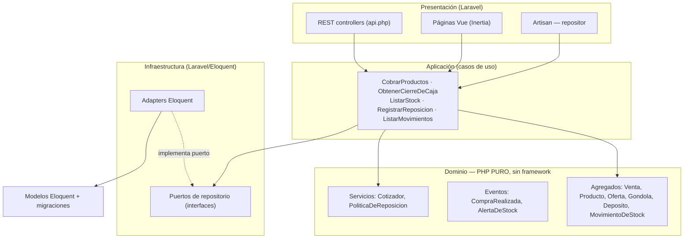
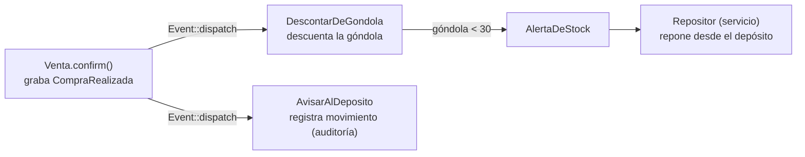

# Supermercado Stock — Laravel + DDD (hexagonal) + Eventos + Vue

[](https://github.com/Fabrizio-Alvarez/Ejercicio-Arquitectura/actions/workflows/ci.yml)

Backend de gestión de stock de supermercado (punto de venta, cierre de caja,
reposición, alertas de stock bajo) y **frontend Vue 3 + Inertia.js**, construido en
**Laravel 13 + PHP 8.4** con una arquitectura **Domain-Driven Design / hexagonal**
estricta y **eventos de dominio**.

Lo interesante **no** es la lista de features: es la **arquitectura**. La **capa de
dominio es PHP puro**, testeada aislada, **sin framework ni base de datos**. Eso es lo
que prueba que la frontera hexagonal es real y no decoración.

> El headline del repo: los tests unitarios del dominio **no bootean nada de Laravel**.

---

## Arquitectura



- **Dominio** no sabe nada de Laravel, la DB ni HTTP. Sigue un **modelo rico**: la lógica vive en
  las entidades, no en servicios anémicos. Un `Dinero` no mezcla monedas y sabe sumarse
  (`Dinero::sum`); una `Venta` no se confirma vacía ni se edita tras confirmarse, y expone sus reglas
  (`isConfirmed`, `isForCashier`, `isOnDay`); `Gondola`/`Deposito` son dueñas de su umbral de stock
  bajo y de sus operaciones (`gapTo`, `maxAvailableFor`, `wouldBeLowAfter`). La regla de reposición
  (<30 → llenar a 50, alerta si depósito <150) es un orquestador delgado (`PoliticaDeReposicion`)
  que **le pregunta** a esas entidades (Tell, Don't Ask).
- **Aplicación** orquesta los casos de uso contra **puertos de repositorio**
  (interfaces definidas en el dominio) y **despacha los eventos de dominio**.
- **Infraestructura** provee los adapters Eloquent que traducen filas ↔ objetos de dominio.

La dependencia siempre va **hacia adentro**: el dominio no depende de nada.

---

## Flujo de eventos (compra → depósito → repositor)



- La **Venta** es un aggregate: líneas, total, **método de pago** y estado. Al
  confirmarse graba `CompraRealizada`.
- **DescontarDeGondola**: descuenta el stock de exhibición (de donde sale el producto).
- **AvisarAlDeposito**: el depósito deja huella del movimiento (no descuenta backstock en la venta).
- **AlertaDeStock**: cuando la góndola o el depósito caen bajo su mínimo.
- **Repositor**: un servicio **sin identidad** que repone la góndola desde el depósito
  al recibir la alerta.

---

## Casos de uso

| # | Caso de uso | Dónde |
|---|-------------|-------|
| 1 | Cotizar productos aplicando ofertas activas | `Cotizador` + `CobrarProductos` |
| 2 | Registrar una venta | `Venta` aggregate + `CobrarProductos` |
| 3 | Cierre de caja (por cajero/día) | `CierreDeCaja` + `ObtenerCierreDeCaja` |
| 4 | Listar stock | `ListarStock` |
| 5 | Registrar reposición | `RegistrarReposicion` + `PoliticaDeReposicion` |
| 6 | Emitir alerta de stock bajo | `AlertaDeStock` (al reposicionar y al vender) |

---

## API REST

| Método | Ruta | Body / Query |
|--------|------|--------------|
| `POST` | `/api/checkout` | `{saleId, cashierId, customerName, paymentMethod, items:[{productId,quantity}]}` → 201, venta + total |
| `GET`  | `/api/stock` | → stock por producto (góndola + depósito + flags de bajo) |
| `POST` | `/api/replenish/{productId}` | → resultado de reposición + alerta |
| `GET`  | `/api/cash-close` | `?cashierId=&date=` → cierre de caja del día |

`paymentMethod` ∈ `efectivo · tarjeta_credito · tarjeta_debito · transferencia · qr`.

CLI del repositor: `php artisan stock:replenish {productId}`

---

## Frontend (Vue 3 + Inertia.js)

| Ruta | Perfil | Página | Qué hace |
|------|--------|--------|----------|
| `/iniciar` | (selector) | `Perfiles/Iniciar.vue` | Selector de perfil: cajero / depositista / repositor |
| `/cobrar` | Cajero | `Cobrar.vue` | Registrar venta (producto, cantidad, método de pago) → `POST /api/checkout` |
| `/movimientos` | Depositista | `Movimientos.vue` | Auditoría de movimientos del depósito |
| `/stock` | Repositor | `Stock.vue` | Stock por producto con flags de góndola/depósito bajo |

Cada perfil ve solo su vista (sin login): `/iniciar` persiste el perfil en sesión vía el **Facade `Perfil`**, y el middleware `RequierePerfil` gatea las rutas por perfil.

---

## Cómo correr

```bash
# Backend vía Docker (no hay PHP nativo en Windows):
docker compose run --rm app composer install
docker compose run --rm app php artisan migrate
docker compose run --rm app php artisan serve --host=0.0.0.0 --port=8000

# Frontend (nativo, Node 24):
npm install
npm run build   # o npm run dev para HMR
```

Storage **SQLite** (`:memory:` en tests, archivo en dev). Imagen de producción vía
`Dockerfile` (single container, `php artisan serve`, lee `PORT`).

---

## Cómo testear

```bash
docker compose run --rm app php vendor/bin/pest
```

Pirámide de tests:
- **Unit (dominio puro)** — `tests/Unit/Domain/**`: Dinero, Oferta, aggregate Venta
  (state machine, invariante de moneda, método de pago), Cotizador, PoliticaDeReposicion.
  Sin Laravel, sin DB.
- **Feature (persistencia + casos de uso + HTTP + eventos + web)** — `tests/Feature/**`:
  adapters de repositorio contra SQLite real, los casos de uso, la API REST, el **flujo
-  de eventos** (`FlujoDeCompraTest`), las **páginas Inertia** (`PaginasWebTest`) y el **gating por perfil** (`PerfilTest`).

---

## Casos de estudio — decisiones defendibles

- **Por qué hexagonal / dominio puro.** El dominio es donde viven y cambian las reglas
  de negocio. Mantenerlo libre de framework lo hace testeable a la velocidad del
  pensamiento, sin bootstrap, y portable a otro framework sin reescribir la lógica.
- **`Dinero` value object (integer cents).** Los montos se guardan y operan como cents
  enteros, nunca floats — el clásico bug `0.1 + 0.2 ≠ 0.3` es estructuralmente imposible.
  Operaciones entre monedas distintas lanzan.
- **Precio congelado al vender.** Una `LineaDeVenta` snapshottea el precio unitario
  (posiblemente descontado), así el total de una venta es inmutable aunque cambien las
  ofertas después — las ventas son auditables.
- **Eventos de dominio grabados en el aggregate.** `Venta::confirm()` graba
  `CompraRealizada`; la aplicación lo despacha. Así el aggregate expresa "qué pasó"
  sin acoplarse a quién lo escucha (góndola, depósito, repositor).
- **Repositor como servicio sin identidad.** Reacciona a `AlertaDeStock` reponiendo la
  góndola desde el depósito. No es una entidad; es un servicio reactivo.
- **Regla de reposición como decisión pura.** `PoliticaDeReposicion::decide` es función
  pura de (gondola, deposito) → (movimiento, alerta). La capa de aplicación la aplica y
  persiste. Testeada exhaustivamente, incluido el límite exacto de 150.
- **Selector de perfiles vía Facade.** El perfil actual vive en sesión, expuesto por el
  Facade `Perfil` (`Perfil::actual()`) — controladores y middleware no tocan la sesión.
  El enum `Perfil` (puro) define qué ve cada rol; `RequierePerfil` gatea. Sin login, listo
  para evolucionar a auth real sin tocar los controladores.

---

## Spec

Requisitos originales: [`docs/specs/Especificaciones funcionales.md`](docs/specs/Especificaciones%20funcionales.md)
y [`docs/specs/Especificaciones no funcionales.md`](docs/specs/Especificaciones%20no%20funcionales.md).

---

## Deploy

Single container vía `Dockerfile` (lee `PORT`, corre migraciones + seed al iniciar). En
[Railway](https://railway.app):

1. **New Project → Deploy from GitHub repo** → este repo.
2. Railway detecta el `Dockerfile`, buildea y deploya (inyecta `PORT`).
3. Settings → Networking → **Generate Domain** → URL pública.
4. Probar `<url>/up` (health), `<url>/stock` (frontend) y `<url>/api/stock` (API).
