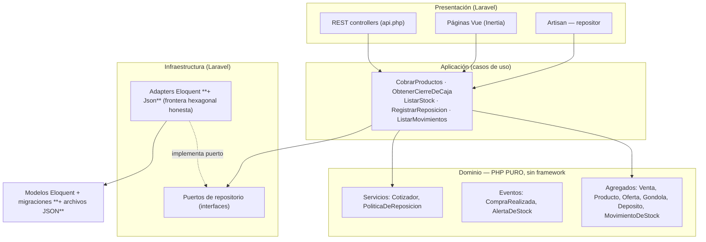
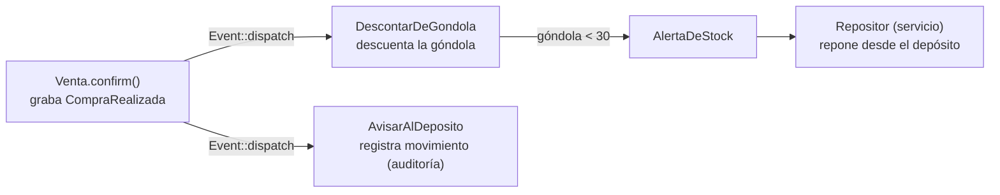

# Supermercado Stock — Laravel + DDD (hexagonal) + Eventos + Vue

[](https://github.com/Fabrizio-Alvarez/Ejercicio-Arquitectura/actions/workflows/ci.yml)

Backend de gestión de stock de supermercado (punto de venta, cierre de caja,
reposición, alertas de stock bajo) y **frontend Vue 3 + Inertia.js**, construido en
**Laravel 13 + PHP 8.4** con una arquitectura **Domain-Driven Design / hexagonal**
estricta y **eventos de dominio**.

Lo interesante **no** es la lista de features: es la **arquitectura**. La **capa de
dominio es PHP puro**, testeada aislada, **sin framework ni base de datos**. Eso es lo
que prueba que la frontera hexagonal es real y no decoración.

> El headline del repo: los tests unitarios del dominio **no bootean nada de Laravel**.

---

## Arquitectura



- **Dominio** no sabe nada de Laravel, la DB ni HTTP. Sigue un **modelo rico**: la lógica vive en
  las entidades, no en servicios anémicos. Un `Dinero` no mezcla monedas y sabe sumarse
  (`Dinero::sum`); una `Venta` no se confirma vacía ni se edita tras confirmarse, y expone sus reglas
(`isConfirmed`, `isForCashier`, `isOnDay`); `Gondola`/`Deposito` son dueñas de su umbral de stock
bajo (**configurable por producto**, default 30/150, vía `configurarUmbral()`) y de sus operaciones
(`gapTo`, `maxAvailableFor`, `wouldBeLowAfter`). La regla de reposición (<umbral → llenar a 50,
alerta si depósito <umbral) es un orquestador delgado (`PoliticaDeReposicion`)
  que **le pregunta** a esas entidades (Tell, Don't Ask).
- **Aplicación** orquesta los casos de uso contra **puertos de repositorio**
  (interfaces definidas en el dominio) y **despacha los eventos de dominio**.
- **Infraestructura** provee los adapters Eloquent que traducen filas ↔ objetos de dominio.

La dependencia siempre va **hacia adentro**: el dominio no depende de nada.

---

## Flujo de eventos (compra → depósito → repositor)



- La **Venta** es un aggregate: líneas, total, **método de pago** y estado. Al
  confirmarse graba `CompraRealizada`.
- **DescontarDeGondola**: descuenta el stock de exhibición (de donde sale el producto).
- **AvisarAlDeposito**: el depósito deja huella del movimiento (no descuenta backstock en la venta).
- **AlertaDeStock**: cuando la góndola o el depósito caen bajo su mínimo. El listener
  **RegistrarAlerta** **persiste** cada alerta (góndola al vender, depósito al reponer).
- **Repositor**: un servicio **sin identidad** que repone la góndola desde el depósito
  al recibir la alerta de góndola.

---

## Casos de uso

| # | Caso de uso | Dónde |
|---|-------------|-------|
| 1 | Cotizar productos aplicando ofertas activas | `Cotizador` + `CobrarProductos` |
| 2 | Registrar una venta | `Venta` aggregate + `CobrarProductos` |
| 3 | Cierre de caja (por cajero/día) | `CierreDeCaja` + `ObtenerCierreDeCaja` |
| 4 | Listar stock | `ListarStock` |
| 5 | Registrar reposición | `RegistrarReposicion` + `PoliticaDeReposicion` |
| 6 | Emitir y **persistir** alerta de stock bajo | `AlertaDeStock` + `AlertaDeStockRepository` (al vender y al reponer) |
| 7 | Reabastecer depósito | `RegistrarReabastecimiento` + `Deposito::receive` |
| 8 | Tablero consolidado por rol | `ObtenerTablero{Cajero,Depositista,Repositor}` |
| 9 | Gestión de catálogo (CRUD productos + ofertas) | `Crear/Actualizar/EliminarProducto` · `CrearOferta` |
| 10 | Ajuste manual de stock (góndola/depósito) | `RegistrarAjuste` |
| 11 | Log de auditoría (event sourcing ligero) | `RegistrarEventoDeDominio` + `ListarEventos` |
| 12 | Reportes históricos (ventas + movimientos) | `ObtenerReporteVentas` · `ObtenerReporteMovimientos` |
| 13 | Alertas de stock configurables por producto | `ConfigurarUmbrales` · `Gondola/Deposito.configurarUmbral()` |
---

## API REST

| Método | Ruta | Rol | Body / Query |
|--------|------|-----|--------------|
| `POST` | `/api/tokens` | — | `{email, password}` → token Bearer (login API) |
| `POST` | `/api/checkout` | cajero | `{saleId, cashierId, customerName, paymentMethod, items}` → 201, venta + total |
| `GET`  | `/api/cash-close` | cajero | `?cashierId=&date=` → cierre de caja del día |
| `GET`  | `/api/stock` | repositor | → stock por producto (góndola + depósito + flags de bajo) |
| `POST` | `/api/replenish/{productId}` | repositor | → resultado de reposición + alerta |
| `POST` | `/api/restock/{productId}` | depositista | `{quantity, proveedor?}` → nivel del depósito tras reabastecer |
| `GET`  | `/api/products` | depositista | → lista de productos (id, nombre, precio, moneda) |
| `POST` | `/api/products` | depositista | `{id, nombre, precio, moneda}` → 201 |
| `PUT`  | `/api/products/{id}` | depositista | `{nombre, precio, moneda}` → 200 |
| `DELETE` | `/api/products/{id}` | depositista | → 200 |
| `POST` | `/api/offers` | depositista | `{productoId, porcentaje, validoDesde, validoHasta}` → 201 |
| `DELETE` | `/api/offers/{id}` | depositista | → 200 |
| `POST` | `/api/adjust/{productId}` | depositista | `{ubicacion, delta, motivo?}` → 200 |
| `PUT`  | `/api/threshold/{productId}` | depositista | `{umbral_gondola?, umbral_deposito?}` → 200 |

Todos los endpoints (salvo `/api/tokens`) requieren `auth:sanctum` + el rol indicado (middleware `rol`). 401 sin autenticación, 403 con rol incorrecto.

`paymentMethod` ∈ `efectivo · tarjeta_credito · tarjeta_debito · transferencia · qr`.

CLI: `php artisan stock:replenish {productId}` (repositor) · `php artisan stock:restock {productId} {cantidad} {--proveedor=}` (depositista).

---

## Frontend (Vue 3 + Inertia.js)

| Ruta | Perfil | Página | Qué hace |
|------|--------|--------|----------|
| `/login` | (auth) | `Perfiles/Login.vue` | Login con email + password (users con `rol`) |
| `/tablero` | Todos | `Tablero.vue` | Dashboard por rol: KPIs de ventas (cajero), alertas y movimientos (depositista), stock crítico (repositor) |
| `/cobrar` | Cajero | `Cobrar.vue` | Registrar venta (producto, cantidad, método de pago) → `POST /api/checkout` |
| `/cierre` | Cajero | `Cierre.vue` | Cierre de caja del día (por cajero) → `GET /api/cash-close` |
| `/movimientos` | Depositista | `Movimientos.vue` | Auditoría de movimientos del depósito |
| `/alertas` | Depositista | `Alertas.vue` | Historial de alertas de stock bajo persistidas |
| `/stock` | Repositor | `Stock.vue` | Stock por producto con flags de góndola/depósito bajo |
| `/catalogo` | Depositista | `Catalogo.vue` | CRUD de productos + ofertas + configuración de umbrales de alerta |
| `/auditoria` | Depositista | `Auditoria.vue` | Log de auditoría: eventos de dominio persistidos |
| `/reportes` | Cajero, Depositista | `Reportes.vue` | Histórico de ventas y movimientos con gráficos CSS |

Cada perfil ve solo sus vistas tras **login real** (users con `rol` mapeado a `Perfil`). El **Facade `Perfil`** expone el perfil del usuario autenticado; el middleware `RequierePerfil` gatea las rutas por rol. Seeder con users demo (`cajero@`/`depositista@`/`repositor@supermercado.test`, password `password`).

---

## Cómo correr

```bash
# Backend vía Docker (no hay PHP nativo en Windows):
docker compose run --rm app composer install
docker compose run --rm app php artisan migrate
docker compose run --rm app php artisan serve --host=0.0.0.0 --port=8000

# Frontend (nativo, Node 24):
npm install
npm run build   # o npm run dev para HMR
```

Storage configurable: **SQLite** (default) o **Postgres** (`--profile postgres`, `DB_CONNECTION=pgsql`); además, un **adapter JSON en disco** (`SUPERMERCADO_PERSISTENCE=json`) cumple el spec no funcional de "archivos de texto plano" sin tocar el dominio. Imagen de producción vía `Dockerfile` (single container, `php artisan migrate --seed`, lee `PORT`; `pdo_sqlite` + `pdo_pgsql`).

---

## Cómo testear

```bash
docker compose run --rm app php vendor/bin/pest
```

Pirámide de tests:
- **Unit (dominio puro)** — `tests/Unit/Domain/**`: Dinero, Oferta, aggregate Venta
  (state machine, invariante de moneda, método de pago), Cotizador, PoliticaDeReposicion.
  Sin Laravel, sin DB.
- **Feature (persistencia + casos de uso + HTTP + eventos + web + auth)** — `tests/Feature/**`:
  adapters Eloquent contra SQLite real, **los mismos ports sobre JSON en disco** (`Json*RepositoryTest`),
  los casos de uso, la API REST, el **flujo de eventos** (`FlujoDeCompraTest`), las **alertas persistidas**
  (`AlertaRepositoryTest`, `AlertasPersistidasTest`), las **páginas Inertia** (`PaginasWebTest`), el **gating
  por rol** (`PerfilTest`) y el **login/logout** (`AuthTest`).

---

## Casos de estudio — decisiones defendibles

- **Por qué hexagonal / dominio puro.** El dominio es donde viven y cambian las reglas
  de negocio. Mantenerlo libre de framework lo hace testeable a la velocidad del
  pensamiento, sin bootstrap, y portable a otro framework sin reescribir la lógica.
- **`Dinero` value object (integer cents).** Los montos se guardan y operan como cents
  enteros, nunca floats — el clásico bug `0.1 + 0.2 ≠ 0.3` es estructuralmente imposible.
  Operaciones entre monedas distintas lanzan.
- **Precio congelado al vender.** Una `LineaDeVenta` snapshottea el precio unitario
  (posiblemente descontado), así el total de una venta es inmutable aunque cambien las
  ofertas después — las ventas son auditables.
- **Eventos de dominio grabados en el aggregate.** `Venta::confirm()` graba
  `CompraRealizada`; la aplicación lo despacha. Así el aggregate expresa "qué pasó"
  sin acoplarse a quién lo escucha (góndola, depósito, repositor).
- **Repositor como servicio sin identidad.** Reacciona a `AlertaDeStock` reponiendo la
  góndola desde el depósito. No es una entidad; es un servicio reactivo.
- **Regla de reposición como decisión pura.** `PoliticaDeReposicion::decide` es función
  pura de (gondola, deposito) → (movimiento, alerta). La capa de aplicación la aplica y
  persiste. Testeada exhaustivamente, incluido el límite exacto de 150.
- **Login + roles reales, perfil vía Facade.** El perfil se deriva del usuario autenticado
  (`User::perfil()` mapea `rol` → `Perfil`) y se expone por el Facade `Perfil` — controladores y
  middleware no cambian respecto del selector anterior: `Perfil::actual()` sigue siendo la API.
  `RequierePerfil` gatea por rol; `/login` + `/logout` con users demo en el seeder.
- **Adapter JSON: la frontera hexagonal es honesta.** Por cada port del dominio hay **dos**
  adapters (Eloquent + Json) elegibles por env (`SUPERMERCADO_PERSISTENCE`). Cambiar el origen de
  datos (SQLite/Postgres ↔ archivos JSON) no toca una línea del dominio — la prueba de que la
  arquitectura no es decoración.

---

## Spec

Requisitos originales: [`docs/specs/Especificaciones funcionales.md`](docs/specs/Especificaciones%20funcionales.md)
y [`docs/specs/Especificaciones no funcionales.md`](docs/specs/Especificaciones%20no%20funcionales.md).

---

## Deploy

Single container vía `Dockerfile` (lee `PORT`, corre migraciones + seed al iniciar). En
[Railway](https://railway.app):

1. **New Project → Deploy from GitHub repo** → este repo.
2. Railway detecta el `Dockerfile`, buildea y deploya (inyecta `PORT`).
3. Settings → Networking → **Generate Domain** → URL pública.
4. Probar `<url>/up` (health), `<url>/stock` (frontend) y `<url>/api/stock` (API).
